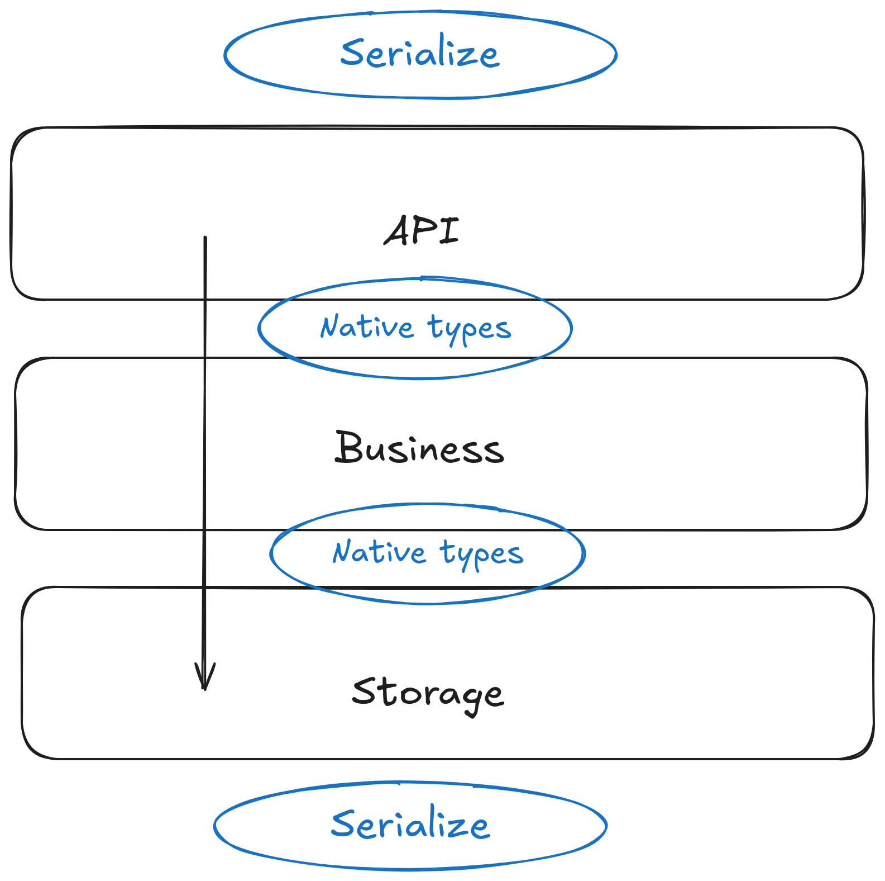

## JSON - The Fine Print
+++
title = "JSON - The Fine Print"
date = "FIXME"
tags = ["golang", "json"]
categories = ["golang"]
url = "FIXME"
author = "mikit"
+++

<!--
playground/validator
dynamic json (RawJSON, mapstructure)
-->

### Introduction

Everybody knows [JSON](https://www.json.org/), it's a simple serialization format and the default format for REST APIs.
However, the devil is in the details.
In this article, we'll explore some big picture aspects of using JSON and some low level details.

### Serialization

Before diving into JSON, I'd like to take a look at serialization in general and discuss common mistakes I've seen my customers make.

Serialization is the process of converting a value in Go to bytes on one side and converting a sequence of bytes to a value on the other side.
The question is: Why do you need serialization?

The answer is that under the hood, computers store everything in bytes.
When you need to transfer data between two pieces of code that don't share memory,
you first need to serialize the data and then transfer it.
You'll use serialization in network operations, saving data to disk or a database and more.

### Common Mistakes in Serialization

The first mistake is passing serialized data in regular function calls.
For example, say you pass time as the string `"2024-08-19T12:12:39.295144041Z"`,
which means that when you want to do some date related operations, say get the year, 
you need to call `time.Parse` to convert it back to a `time.Time` object.
You should serialize only at the "edges" of your program, when it interacts with the outside world.

If you look at the major three layers of a program, then only the API and the storage layers should serialize when dealing with the outside world.




The second mistake is using the same data structure in different layers of your code.
When you work with document oriented databases, such as ElasticSearch,
It is super convenient to get a request for a document, pluck it from the database and return it "as is".
However, you are tying the storage layer to the business layer to the API layer.
Which means that if you make a change to the database schema, you have changed your API - not a recipe for happy users.

Each of these layers have a different change velocity.
The API layer has low to zero velocity, the business layer has high velocity and the storage layer has medium velocity.
Say you have a `User` type in your system.
You should have a different `User` type at each layer.


At the beginning, these `User` types look the same.
But, over time, each layer `User` type diverges.
This way, you can make database schema changes without affecting your API.

You should also only look "down" at types, the storage layer knows only about its `User`,
while the business layer knows about its `User` and also the storage `User` so it'll be able to convert between these types.

The third mistake is not validating incoming data.
An income request that is valid JSON does not mean a valid request.
Consider the following request:

**Listing 1: A JSON Request**

```json
01 {
02   "car_id": "CAR3",
03   "lat": 0.7579787,
04   "lng": -173.9881175,
05   "passenger_count": 3,
06   "shared": true
07 }
```

Listing 1 shows a JSON request.

The request is a valid JSON, but the longitude (`lng`) is above the maximal longitude value of 180.

### JSON

Let's start diving into the JSON format.

JSON is a text based format without schema.
Text based makes it readable to humans, but you pay a price in the size of the encoded data.
For example, you can encode the number `123` can in a single byte,
but in JSON it's encoded as the string `123` which is three bytes.

No schema means you can quickly develop and change the data.
However, no schema means you need to work harder on validating incoming data.

Every serialization protocol defines its own set of types,
and it's up to the language to decide on the mapping between JSON types and the types in the language.

In Go, the mapping is as follows:

| JSON Type | Go Type(s)                                                  |
|-----------|-------------------------------------------------------------|
| string    | string                                                      |
| number    | float64, float32, int, int8, ... int64, uint8 ... uint64    |
| boolean   | bool                                              |
| null      | nil                                                         |
| array     | []T, []any                                                  |
| object    | struct, map[string]any                                      |


Some points to consider:
- Not everything in Go is nil-able. In JSON you can have a `null` string member, but in Go you can't have a nil string field.
- JSON has one number type, Go has many.
- JSON arrays can have mixed types, Go slices can't - unless you use `[]any` which is painful since you need to do type assertions.
- Using structs, you can give `encoding/json` hints on how to convert JSON types to Go types.
- Some things are missing from JSON
- `timestamp` like Go's `time.Time`.
- Binary type such as Go's `[]byte`.
- Comments

## `encoding/json` API

Go has built-in support for JSON serialization and in the `encoding/json` package.
This package defines the following API:

| From | Via       |  To  | Method         |
|------|-----------|------|----------------|
| JSON | bytes     | Go   | json.Unmarshal |
| Go   | bytes     | JSON | json.Marshal   |
| JSON | io.Reader | Go   | json.NewDecoder |
| Go   | io.Writer | JSON | json.NewEncoder |

`encoding/json` can work in memory with `[]byte` or in streaming with `io.Reader` and `io.Writer`.

Pick the right method depending on the situation.
For example, if you decode an incoming HTTP request body that implements `io.Reader`, use `json.NewDecoder`.

### Unmarshaling

Most of the time, you'll work with structs to marshal or unmarshal JSON.
`encoding/json` looks only at exported fields (ones starting with capital letter).
It ignores struct fields missing from the JSON document and any JSON members that don't appear in the struct.

**Listing 2: Redundant Fields**

```go
09     data := []byte(`
10     {
11         "login": "elliot",
12         "nick": "Mr. Robot"
13     }`)
14 
15     type User struct {
16         Login string
17         UID   int
18     }
19 
20     var u User
21     if err := json.Unmarshal(data, &u); err != nil {
22         return err
23     }
24     fmt.Printf("%+v\n", u) // {Login:elliot UID:0}
```

Listing 2 shows unmarshaling JSON document.
On lines 09-13 you define the JSON data with "login" and "nick" members.
On lines 15-18 you define the `User` type with `Login` and `U
On line 20 you define a `u` variable and on lines 21-23 you unmarshal the JSON data into it.
Finally, on line 24 you print `u`. You can see that there's no error and only `Login` was filled.

`encoding/json` works only with exported fields that start with uppercase letters.
However, in JSON the convention is to use lower case names.
`encoding/json` has a heuristic to convert names from JSON to Go,
and in Listing 2 uses the `login` from the JSON document to fill the `Login` field.

Say you have a JSON document with `name` member and you want to use it to populate the `Login` field,
for this you can use [field tags](https://go.dev/ref/spec#Struct_types).

**Listing 3: Using Field Tags**

```go
09     data := []byte(`
10     {
11         "name": "elliot",
12         "uid": 1000
13     }`)
14 
15     type User struct {
16         Login string `json:"name"`
17         UID   int
18     }
19 
20     var u User
21     if err := json.Unmarshal(data, &u); err != nil {
22         return err
23     }
24     fmt.Printf("%+v\n", u) // {Login:elliot UID:1000}
25     return nil
26 }
```

Listing 3 shows how to use field tags.
On lines 10-13 you have a JSON document with a `name` member.
On lines 15-18 you define the `User` struct.
On line 16 you use the field tag `json:"name"` to tell `encoding/json` to use the `name` member to fill the `Login` field.
On lines 20-23 you unmarshal the JSON document to the `u` variable and on line 24 you print it.
You can see that the `Login` field is filled from the `name` JSON member.

The field tags used by `encoding/json` has a mini-language, 
[read the documentation](https://pkg.go.dev/encoding/json#Marshal) to learn more.

### Missing vs Zero Values

Go initializes each variable to its zero value.
If you declare `var s string` then Go will assign `s` to the empty string (`""`),
which is the zero value for strings.
Default initialization is great, but when working with JSON it creates an issue of zero vs missing values.

Let see an example, say you have the following request for starting a virtual machine (VM).

**Listing 4: `StartVM` struct

```go
08 type StartVM struct {
09     Image string
10     Count int
11 }
```

Listing 4 shows the request for starting a VM.
On line 9 we have the image and on line 10 we have a count of how many VMs to start.

You parse an incoming request, in the `Image` field you see `"debian:bookworm-slim"` and in the `Count` field you see `0`.
Now you have a problem, 
if the user actually sent a `0`, it's an error,
but if the user didn't send `count` in the JSON, you need to default to `1`.
How can you know?

Below you'll see three ways to solve this missing-vs-zero value,
each with its own pluses and minuses.

_NOTE: I'm going to use the same data for all the examples: `data := []byte(`{"image": "debian:bookworm-slim"}`)`_

#### Using a Pointer

**Listing 5: Using a Pointer**

```go
24 type StartVMPtr struct {
25     Image string
26     Count *int
27 }
```

Listing 5 shows the `StartVMPtr` struct. On line 24 you define the count as a pointer to `int`.

**Listing 6: Unmarshaling with a Pointer**

```go
32     var req StartVMPtr
33     if err := json.Unmarshal(data, &req); err != nil {
34         return err
35     }
36 
37     if req.Count == nil { // User didn't send "count", use default value
38         c := 1
39         req.Count = &c
40     }
41 
42     if *req.Count < 1 {
43         return fmt.Errorf("bad count: %d", *req.Count)
44     }
```

Listing 6 shows how to use `StartVMPtr`.
On lines 32-35 you define `req` and unmarshal the request data to it.
On line 37 you check if `req.Count` is `nil`,
if `req.Count` is `nil` it means the user didn't send `count` in the request JSON,
and then on lines 38,39  you assign the default value of `1` to `req.Count`.

On lines 42-44 you check that `req.Count` is a valid value.
You should do the same for `req.Image`.

The problem with the pointer approach is that you use pointers,
which might lead to `nil` pointer panics and also makes it harder to work with `req.Count` since you need to dereference (e.g. `*req.Count`) it every time you need the actual int value.

#### Using a Map

Another option is to use a `map[string]any`, then you can check if `count` is in the incoming JSON.

**Listing 7: Using a Map**

```go
53     var m map[string]any
54     if err := json.Unmarshal(data, &m); err != nil {
55         return err
56     }
57 
58     if _, ok := m["count"]; !ok { // User didn't send "count", use default value
59         m["count"] = 1
60     }
61 
62     image, ok := m["image"].(string)
63     if !ok || image == "" {
64         return fmt.Errorf("bad image: %#v", m["image"])
65     }
66 
67     count, ok := m["count"].(float64)
68     if !ok {
69         return fmt.Errorf("bad count: %#v", m["count"])
70     }
71 
72     if count < 1 {
73         return fmt.Errorf("bad count: %f", count)
74     }
75 
76     req := StartVM{
77         Image: image,
78         Count: int(count),
79     }
```

Listing 7 shows how to use a map to know if the user passed `count`.
On lines 53-56 you unmarshal the request data to `map[string]any`.
On lines 58-60 you check if `m` has a `count` key and if not assign it to the default value of `1`.
On lines 62-65 you extract the `image` value from `m` and use type assertion to convert it to a string.
On lines 67-70 you extract `count` the same way, note that `count` has the type of `float64` which is what `encoding/json` default to in JSON numbers.
On lines 72-74 you check count for a valid value.
Finally, on lines 76-79 you create the request.
On line 78 you convert `count` from `float64` to an `int`.

This approach has much more code, and every time you work with `any` you need to do type assertions.
To ease the pain, you can look at [mapstructure](https://pkg.go.dev/github.com/mitchellh/mapstructure) that unmarshals from `map[string]any` into a struct.

#### Using Default Values

The last approach, which I prefer, is to use default values.

**Listing 8: Using default values**

```go
88     req := StartVM{
89         Count: 1,
90     }
91 
92     if err := json.Unmarshal(data, &req); err != nil {
93         return err
94     }
95 
96     if req.Count < 1 {
97         return fmt.Errorf("bad count: %d", req.Count)
98     }
```

Listing 8 shows how to use default values.
On lines 88-90 you create `req` with the `Count` field initialized to `1`.
On lines 92-94 you unmarshal the data into `req`.
On lines 96-98 you check that `req.Count` is valid.
If the user didn't send `count`, then `encoding/json` won't change `Count` and it'll stay the default 1.
If the user does send `count`, it'll override the current value in `Count` and you can check for correctness.

### Avoiding Type Pollution

Say you'd like to parse a very complex JSON, but you need only parts of it.
For this example, look at the JSON returned from [stocktwits](https://stocktwits.com/).

To get the JSON for Apple, head over to https://api.stocktwits.com/api/2/streams/symbol/AAPL.json.
The pretty-printed returned JSON is about 2,680 lines.
I'm not going to show the whole JSON, but only a redacted version of it:

**Listing 9: AAPL JSON**

```json
01 {
02   "symbol": {
03     "symbol": "AAPL",
04     "title": "Apple Inc",
05     ...
06   },
07   "messages": [
08     {
09       "id": 583655547,
10       "body": "$AAPL \n\ngoing up until sep event?",
11       "created_at": "2024-08-21T14:25:32Z",
12       "symbols": [
13         {
14           "symbol": "AAPL",
15           ...
16         }
17       ],
18       ...
19     },
20     {
21       "id": 583655288,
22       "body": "$AAPL Continues to show good strength! \nhttps://share.trendspider.com/chart/AAPL/66823y2dkm",
23       "created_at": "2024-08-21T14:24:24Z",
24       "symbols": [
25         {
26           "symbol": "AAPL",
27           ...
28         }
29       ],
30     }
31   ],
32   ...
33 }
```

Listing 9 shows the redacted JSON.
You are only interested in the `messages` member on line 7,
and in each message you are only interested in the `symbols` member (lines 12 & 24).
Inside each symbol, you are only interested in the `symbol` member.

You'd like to know which stocks that are not `AAPL` appear in the message and the count of each.
Something like `{"IBM": 3, "INTC": 2}`.

If you're going to model all of the JSON using structs, you create many structs for each part of it.
However, these structs are one-off and used only for parsing. You create "type pollution".

You can take the fact that `encoding/json` ignores JSON members that do not appear in the struct.
And to avoid type pollution, you can use an anonymous struct.

**Listing 10: Parsing AAPL JSON**

```go
30     var reply struct { // anonymous struct
31         Messages []struct {
32             Symbols []struct {
33                 Symbol string
34             }
35         }
36     }
37 
38     if err := json.Unmarshal(data, &reply); err != nil {
39         return nil, err
40     }
41 
42     related := make(map[string]int)
43     for _, m := range reply.Messages {
44         for _, s := range m.Symbols {
45             if s.Symbol != "AAPL" {
46                 related[s.Symbol]++
47             }
48         }
49     }
```

Listing 10 shows how to parse the complex JSON returned from stocktwits.
On lines 30-36 you define `reply` which is an anonymous struct containing only the fields you are interested in.
On lines 38-48 you unmarshal the JSON data into `reply`.
On lines 42-49 you go over the message and update the `related` count.

Now let's look at the other side - marshaling.
We'll look into two things - custom marshaling and streaming.

### Custom Marshaling

Say you have the following `Value` struct

**Listing 11: Value**

```go
09 type Unit string
10 
11 const (
12     Meter = "meter"
13     Inch  = "inch"
14 )
15 
16 type Value struct {
17     Unit   Unit
18     Amount float64
19 }
```

Listing 11 shows the `Value` struct which has `Unit` and `Amount` fields.

By default, a `Value` will be marshaled by `encoding/json` as an object with `Unit` and `Amount` members.
However, you need to marshal a `Value` as a JSON string in the format `2.1meter`.

You can tell `encoding/json` to use a custom marshaling for your types by implementing the [`json.Marshaler`](https://pkg.go.dev/encoding/json#Marshaler) interface.
When you implement `json.Marshaler` use these three steps:
1. Convert your type to a type `encoding/json` can handle
2. Use `json.Marshal`
3. There is no step 3 :)

**Listing 12: Implementing json.Marshaler**

```go
21 func (v Value) MarshalJSON() ([]byte, error) {
22     // Step 1: Convert to type known to encoding/json
23     s := fmt.Sprintf("%f%s", v.Amount, v.Unit)
24 
25     // Step 2: Use json.Marshal
26     return json.Marshal(s)
27 }
```

Listing 12 shows a custom marshaling for `Value` by implementing the `json.Marshal` interface.
On line 23 you used `fmt.Sprintf` to create a string from the value.
On line 26 you use `json.Marshal` to create a JSON string.

Now a `Value{Meter, 2.1}` will be emitted as `"2.10000meter"`.

If you want to unmarshal that string back to a `Value`, you'll need to implement [`json.Unmarshaler`](https://pkg.go.dev/encoding/json#Unmarshaler).

**Listing 13: Custom Unmarshaling**

```go
29 func (v *Value) UnmarshalJSON(data []byte) error {
30     if len(data) < 2 {
31         return fmt.Errorf("value too small")
32     }
33 
34     // "2.1meter"
35     r := bytes.NewReader(data[1 : len(data)-1]) // trim ""
36     var a float64
37     var u Unit
38     if _, err := fmt.Fscanf(r, "%f%s", &a, &u); err != nil {
39         return err
40     }
41 
42     v.Amount = a
43     v.Unit = u
44 
45     return nil
46 }
```

Listing 13 shows how to implement `json.Unmarshaler`
On line 29 you define `UnmarshalJSON` with a pointer receiver.
You need to use a pointer receiver since you change the fields of this receiver.
On lines 35-40 you use `fmt.Fscanf` to read the values from `data` into `a` and `u`.
I prefer to scan into new variables and not `v`'s fields in case the first scanned value works and the second does not.
One lines 42-43 you assign `a' and `u` to `v`'s fields.

### Streaming JSON

There are cases where the data is too large, or comes at unknown intervals.
In these cases, you'd want to stream the data instead of waiting for all the data to come and then construct a huge JSON reply.

The JSON protocol does not have built-in support for streaming, the common approach is to send one JSON object per line.
This is known as [jsonlines](https://jsonlines.org/) or [ndjson](https://docs.mulesoft.com/dataweave/latest/dataweave-formats-ndjson).

Lucky for you, the built-in `encoding/json` supports streaming.

**Listing 14: Streaming JSON**

```go
09 type Event struct {
10     Type string  `json:"type"`
11     X    float64 `json:"x"`
12     Y    float64 `json:"y"`
13 }
14 
15 func work() error {
16     events := []Event{
17         {"click", 100, 200},
18         {"move", 101, 202},
19     }
20 
21     enc := json.NewEncoder(os.Stdout)
22 
23     for _, e := range events {
24         if err := enc.Encode(e); err != nil {
25             return err
26         }
27     }
28     return nil
29 }
```

Listing 13 shows how to stream JSON.
On lines 09-13 you define `Event`.
On line 16-19 you define the data to stream.
On line 21 you create a `json.Encoder` that emits to the standard outputs,
and on lines 23-27 you use the encoder to encode the data.

If you run the code, you'll see the following output:

**Listing 14: Streaming output**

```json
{"type":"click","x":100,"y":200}
{"type":"move","x":101,"y":202}
```

Listing 14 shows the output of running the code in listing 13.

When using JSON over HTTP, you can use [Chunked transfer encoding](https://en.wikipedia.org/wiki/Chunked_transfer_encoding) which lets you send the output in chunks.

**Listing 15: Streaming JSON over HTTP**

```go
41 func eventsHandler(w http.ResponseWriter, r *http.Request) {
42     ctrl := http.NewResponseController(w)
43 
44     enc := json.NewEncoder(w)
45     for evt := range queryEvents() {
46         if err := enc.Encode(evt); err != nil {
47             // Can't set error
48             slog.Error("JSON encode", "error", err)
49             return
50         }
51 
52         if err := ctrl.Flush(); err != nil {
53             slog.Error("flush", "error", err)
54             return
55         }
56     }
57 }
58 
59 func main() {
60     http.HandleFunc("/events", eventsHandler)
61 
62     addr := ":8080"
63     slog.Info("server starting", "address", addr)
64     if err := http.ListenAndServe(addr, nil); err != nil {
65         fmt.Fprintf(os.Stderr, "error: %s\n", err)
66         os.Exit(1)
67     }
68 }
```

Listing 15 shows how to stream JSON over HTTP using chunked transfer encoding.
On line 42 we create an `http.ResponseController`.
On line 44 we create an encoder and on line 45 we iterate over the events.
On line 52 we call the controller `Flush` method that will send the data right away.
Lines 59-68 show how to run the server on port 8080, the handler is mounted on `/events`.

Let's use `netcat` to view the underlying HTTP traffic.

**Listing 16: Calling Streaming Handler**

```bash
03 nc localhost 8080 << EOF
04 GET /events HTTP/1.1
05 Host: localhost
06 Connection: close
07 
08 EOF
```

Listing 16 shows how to use `netcat` to make an HTTP request.
On line 03 you use `nc` (`netcat` command line) to connect to localhost on port 8080
On lines 04-08 you hand carft an HTTP request.

If you run the server code in listing 15 and then this code, you will see the following output:

**Listing 17: HTTP Chunked Transfer Encoding**

```
01 HTTP/1.1 200 OK
02 Date: Mon, 02 Sep 2024 05:55:46 GMT
03 Content-Type: text/plain; charset=utf-8
04 Connection: close
05 Transfer-Encoding: chunked
06 
07 21
08 {"type":"click","x":100,"y":200}
09 
10 20
11 {"type":"move","x":101,"y":202}
12 
13 20
14 {"type":"move","x":102,"y":203}
15 
16 20
17 {"type":"move","x":103,"y":204}
18 
19 20
20 {"type":"move","x":104,"y":204}
21 
22 21
23 {"type":"click","x":104,"y":204}
24 
25 0
```

Listing 17 shows the raw HTTP traffic.
On line 05 the server sets the `Tranfer-Encoding` HTTP header to `chunked`.
Note there is no `Content-Length` header since the server does not know how much data is sent.
One lines 07-25 you get the data in chunks.
Each chunk is prefixed by the chunk size and then the chunk data.
On line 25 the server signals there's no more data by sending `0` size.

### Receiving Streaming JSON

On the receiving side, the json `Decoder` can handle multiple JSON objects.

**Listing 18: Consuming Streamed JSON**

```go
16 func work() error {
17     var data = `
18     {"type":"click","x":100,"y":200}
19     {"type":"move","x":101,"y":202}
20     `
21 
22     dec := json.NewDecoder(strings.NewReader(data))
23 
24     for {
25         var e Event
26         err := dec.Decode(&e)
27         if err == io.EOF {
28             break
29         }
30         if err != nil {
31             return err
32         }
33         fmt.Println(e)
34     }
35 
36     return nil
37 }
```

Listing 18 shows how to consume streaming data.
On lines 17-19 you define the data to consume.
On line 22 you create the JSON decoder.
One lines 24-34 you loop over the steaming data.
Since you don't know how much data is coming, you run an empty `for` loop.
On line 25 you define the event to be decoded and on line 26 you decode the current event.
On line 27 you check for `io.EOF` that signals the end of data.

### Conclusion

JSON is a simple format, but there are many considerations and techniques to know when working with it.
In this blog post, I've covered the most common practices I use when working with JSON.

If you have any other tips and tricks for working with JSON, I'd love to hear from you.
Reach out to me at miki@ardanlabs.com
