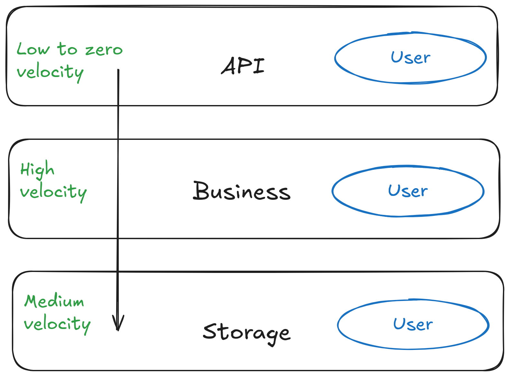

## JSON - The Fine Print: Part 1 - Serialization & JSON
+++
title = "JSON - The Fine Print"
date = "FIXME"
tags = ["golang", "json"]
categories = ["golang"]
url = "FIXME"
author = "mikit"
+++

### Introduction

Everybody knows [JSON](https://www.json.org/), it's a simple serialization format and the default format for REST APIs.
Like many other topics, there are points you need to know to work with JSON effectively and avoid common mistakes.

In this article, we'll explore some big picture aspects of using JSON and some low level details of using JSON.

### Serialization

Before diving into JSON, I'd like to take a look at serialization in general and discuss common mistakes I've seen my customers make.

Serialization is the process of converting a Go value in Go into bytes on one side and then converting this sequence of bytes back to a Go value on the other side.

The question is: Why do you need serialization?

The answer is that under the hood, computers store everything in bytes. When you need to transfer data between two pieces of code that don't share memory, you first need to serialize the data and then transfer it. You'll use serialization in network operations, saving data to disk, with or a  databases, and more.


### Common Serialization Mistakes

I'd like to start with covering some common serialization mistakes. I've seen this mistakes regardless of the serialization format (JSON, YAML, TOML, Protocol buffers, flat buffers ...).


#### Passing Serialized Data In Regular Function Calls

Serialization is used to pass data between code that doesn't share the same memory space. The first mistake is to pass the serialized data between code the does share the same memory space, which leads inefficient code the wastes both CPU and memory.

For example, say you pass time as the string `"2024-08-19T12:12:39.295144041Z"`. This means that when you want to do some date related operations, say get the year, you need to call `time.Parse` to convert it back to a `time.Time` object. You should serialize only at the "edges" of your program, when it interacts with the outside world.

#### Using The Same Data Structures In Different Layers

The second mistake is using the same data structures in different layers of your code.

It's convenient to get a request for a document, pluck it from the database (say Elasticsearch) and return it "as is" to the client. But, you are tying the storage layer to the business layer to the API layer. Say you make a change to the database schema, you have changed your API, or event exposed some sensitive data to the client.

Applications have three major layers: API, business and, storage. Each of these layers has different development velocity (the rate at which the code change of time). The API layer has low to zero velocity, the business layer has high velocity, and the storage layer has medium velocity.



As an example of change velocity, let’s run through a scenario.

Say you have a `User` type in your system and you decide to use a single type for all three layers instead of giving each layer their own `User` type. After a while, the data team adds an "address" field to the user in the database, but the API layer shouldn't export that address to the client due to privacy concerns. If you keep a different `User` type per layer, you can make database schema changes without affecting your API.

Each layer should also only look "down" at types, the storage layer should be unaware of the business or API layer `User`,
while the business layer knows about its `User` and also the storage `User` so it can convert between these types.

#### Not Validating Incoming Data


The third mistake is assuming that valid JSON (or XML or gob or ...) is valid data.

Consider the following request:

**Listing 1: A JSON Request**

```json
01 {
02   "car_id": "CAR3",
03   "lat": 0.7579787,
04   "lng": -173.9881175,
05   "passenger_count": 3,
06   "shared": true
07 }
```

Listing 1 shows a JSON request. The request is provided with a valid JSON, but the longitude (`lng`) value is above the maximal longitude value of 180.

Apart from data integrity, some malicious actors inject bad values and try to crash your system.

You can use libraries such as [validator](https://pkg.go.dev/github.com/go-playground/validator/v10) or [cue](https://cuelang.org/). You can also write your own validation logic in code.

Follow the following rules to avoid these common mistakes:
- Serialize only at the "edges" of your program
- Have a separate data type per application layer (API, business and storage)
- Always validate incoming data


### JSON

JSON is a text based format without schema. 

Being text based makes JSON readable to humans, but you pay a price in the size of the encoded data. For example, you can encode the number `123` can in a single byte, but in JSON it's encoded as the `123` which is three bytes.

Having no schema means you can quickly develop and change the data. But, no schema means you need to work harder on validating incoming data.


#### Types

Every serialization protocol defines its own set of types and it's up to the language to decide on the mapping between JSON types and the types in the language.

In Go, the mapping is as follows:

```
| JSON Type | Go Type(s)                                                  |
|-----------|-------------------------------------------------------------|
| string    | string                                                      |
| number    | float64, float32, int, int8, ... int64, uint8 ... uint64    |
| boolean   | bool                                                        |
| null      | nil                                                         |
| array     | []T, []any                                                  |
| object    | struct, map[string]any                                      |
```

Some points to consider:

- Not everything in Go is nil-able. In JSON you can have a `null` string member, but in Go you can't have a nil string field
- JSON has one number type, Go has many (int, int8, int16, ... int64, uint, ... uint64, float32, float64, ...)
- JSON arrays can have mixed types, Go slices can't - unless you use `[]any`, which hard to work with since you need to do type assertions all the time
- Using structs, you can give `encoding/json` hints on how to convert JSON types to Go types.
- Some types are missing from JSON
    - `timestamp` like Go's `time.Time`.
    - Binary type such as Go's `[]byte`.

#### `encoding/json` API

Go has built-in support for JSON serialization and in the `encoding/json` package. This package defines the following API:

| From | Via       |  To  | Method          |
|------|-----------|------|-----------------|
| JSON | bytes     | Go   | json.Unmarshal  |
| Go   | bytes     | JSON | json.Marshal    |
| JSON | io.Reader | Go   | json.NewDecoder |
| Go   | io.Writer | JSON | json.NewEncoder |

`encoding/json` can work in memory with `[]byte` or in streaming with `io.Reader` and `io.Writer`.

Pick the right method depending on the situation.
For example, if you decode an incoming HTTP request body that implements `io.Reader`, use `json.NewDecoder`.

### Conclusion

In this article I've covered the general principles of working with serialization and looked at the `encoding/json` API. I hope it helped you get a better grasp on the topic. In the next articles I'll dive into details of serializing (marshalling) JSON and de-serializing (unmarshalling).
